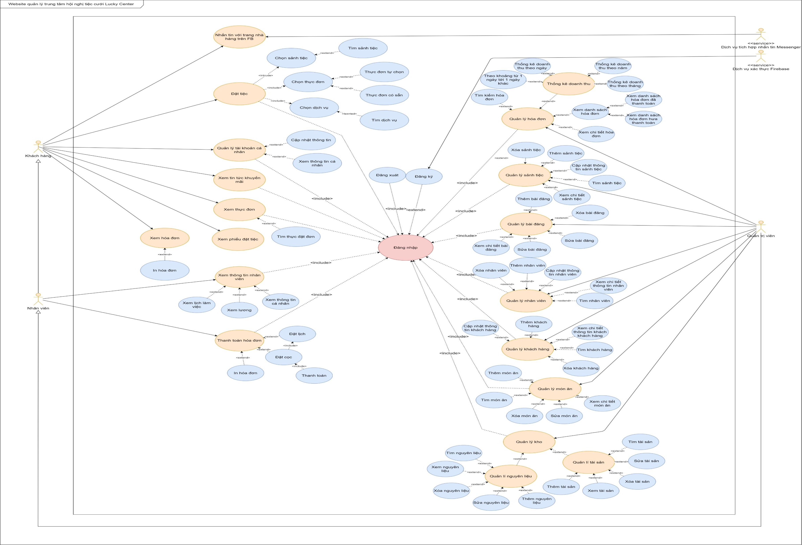
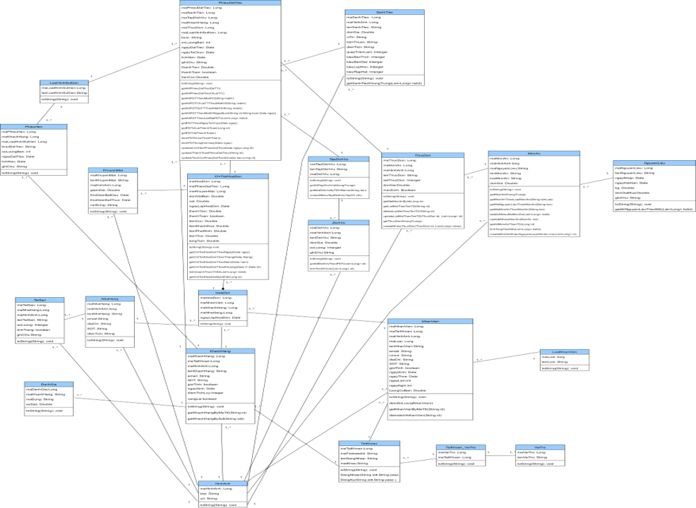
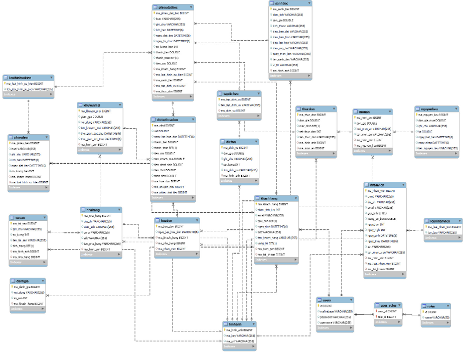

<h1>Website Quản lý nhà hàng-tiệc cưới Lucky Center</h1>
<h2>I.Tổng quan</h2>

- Cho phép đặt tiệc thông qua website: Chọn sảnh tiệc, Chọn dịch vụ, Chọn món ăn: Theo set có sẵn, theo món tự chọn. 
-Thanh toán hóa đơn. 
- Cho phép quản lý thông tin người dùng: Sửa thông tin cá nhân, Xóa tài khoản hiện tại 
- Cho phép quản lý thông tin nhà hàng: Quản lý sảnh tiệc, Quản lý món ăn, Quản lý thực đơn, Quản lý hóa đơn, Quản lý khách hàng, Quản lý nhân viên, Quản lý kho. 
- Cho phép báo cáo thông số: Thống kê hóa đơn, Thống kê doanh thu, Thống kê thu nhập, Thanh toán, đặt cọc hóa đơn. 
- Cho phép đăng ký tài khoản, kích hoạt tài khoản mã code otp sms. 

<h2>II.Công nghệ sử dụng</h2>
<h3>Ngôn ngữ: Reactjs(Dùng thư viện Ant Design)</h3>
<h3>Cơ sở dữ liệu: MySQL (liên kết với CSDL cloud RDS)</h3>
<h3>Deploy Server: S3 Bucket (AWS)</h3>
<h3>Link Github BE: https://github.com/YtalyPham/Public_QLNH_BE</h3>
<h3>Link Demo: https://youtu.be/peu56EkiuKA</h3>
<h3>Link Product: http://qlnhfe.s3-website-ap-southeast-1.amazonaws.com/</h3>
<h2>III.Sơ đồ</h2>
<h3>1.Sơ đồ Usecase</h3>

<h3>2.Sơ đồ lớp</h3>

<h3>3.Sơ đồ CSDL</h3>

